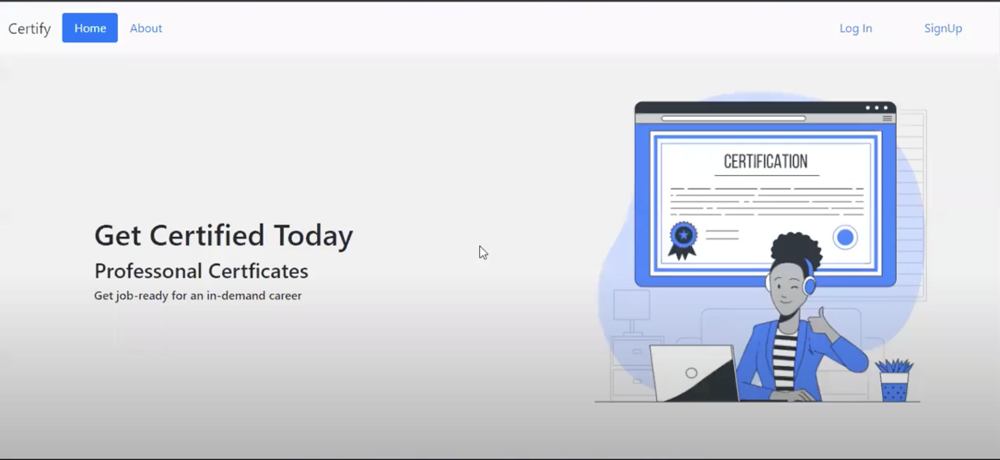
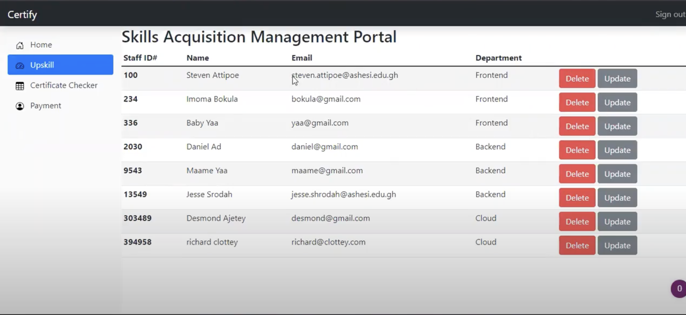
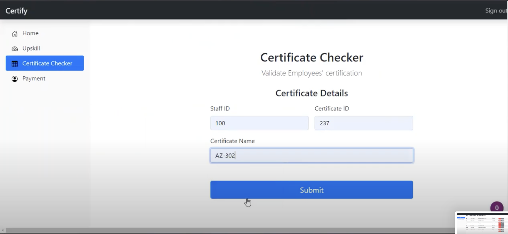
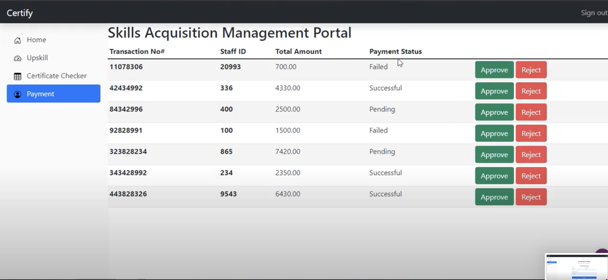

## Certificate Management System
The Certificate Management System is a web-based application built using PHP and the Model-View-Controller (MVC) architectural pattern. The application is designed to help organizations keep track of the various certifications of their employees. With this system, organizations can easily manage employee certifications, track expiration dates, and generate reports.

## Features
Employee Management - The system allows for the addition, modification, and deletion of employee records, including personal details and certification information.
Certification Management - The system provides the ability to add, modify, and delete certification types, along with the expiration period for each type.
Certification Tracking - The system tracks the expiration dates of each certification for all employees and generates reports on upcoming and expired certifications.

## Screenshots

## Requirements
PHP 7.0 or later
MySQL 5.6 or later

## Installation
Clone the repository to your local machine using git clone
Create a new database in MySQL and import the database.sql file to create the necessary tables.
Update the database configuration in the config.php file with your MySQL credentials.
Launch the application by navigating to the project folder in a web browser.

## Usage
After installation, log in to the application using the admin account created during installation. From the dashboard, you can manage employees, certifications, and users. Use the reporting feature to generate reports on certification status and expiration dates.

## Contributions
Contributions to the Certificate Management System are welcome and encouraged. If you find a bug or have an idea for a new feature, please open an issue on the Certificate Management System GitHub page and describe the problem or feature request in detail. If you'd like to contribute code to the project, please submit a pull request with your changes.
